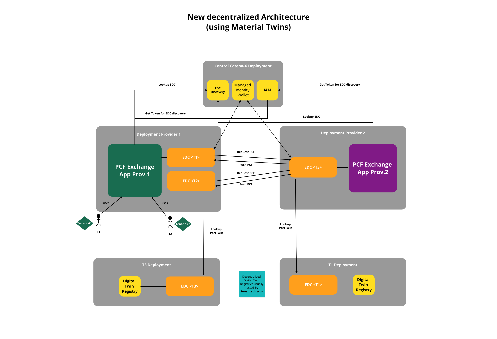

# Developer View

## Introduction

The developer view provides a detailed guide on how to utilize the PCF exchange KIT effectivly. Developer will learn how to integrate the kit into there applications and make use of the feature of exchanging pcf values via the Catena-X network.
IT-Administrators will learn how they need to provide pcf data and which components are needed therefore.

This Kit covers various aspects, starting from how utilizing the available API Endpoints to used data models and how to make them available to the catena-x network.

## Building Block View

The following figure shows the current high level architecture of the use case pcf exchange. It is build on an asyncronous data exchange.



## Sequence View


The following chapter illustrates the process from searching for an EDC point, to querying a PCF value, and finally transmitting the requested value.

### EDC Discovery and dDTR Access

For receiving the EDC Enpoints for a requested partner the EDC Discovery Service is used following the [CX-0001](test) Standard. For receiving endpoints, at least the BPN-L needs to be known to get the related endpoints. For more detailes the used CX Standard is linkend.


### PCF Request

After successfully locating the EDC asset containing the PCF request endpoint, the query for a PCF dataset can be initiated, as illustrated in the attached sequence diagram.


>**Note**
> The API Wrapper shown in the squence diagrams is optional. The management API of the EDC can also be used directly.

### PCF Update

The sequence diagram provided below presents an example of a PCF update flow. An update is feasible only for assets that have been previously requested at least once, as demonstrated in [PCFRequest](##test). Proactive updates without a prior request are not achievable with the current version.


#### API Calls
| Call   | Method | Path| Param|
| ------ | ------ | -------------------------------------------------- | ------------------------------------------ |
| [001] (Look up EDC Enpoints) | POST  | /api/administration/connectors/discovery/search   |    `{[<Company's BPNL>]}` |
| [002] (Look up dDTR) | N/A   | Lookup Asset in catalog (EDC asset type data.core.digital Twin Registry) |                         |
| [003] (Lookup Twin ID)  |  GET | https://someEDCProxyURL/lookup/shells   |`assetIds= [ {"key":" manfactureId", "value":"<Company BPN>"}, {"key": "manfuacturePartId", "value":"mat345",{"key":"assetLifecyclePhase", "value": "AsPlanned"}}]`                     |
| [004] (Look Up PCF Submodel/EDC Asset ID) | GET    | https://someEDCProxyURL/registry/shell-discriptors/                                    | `{DIGITAL TWIN ID}`
|[005] (Requesting PCF Value)|GET| /productIds|{productId}
|006 (Sending PCF Value)| PUT| /productIds|{productId}

- When responding on PCF exchange request the "requestID" is mandatory in the PUT call. 
- When sharing a PCF update the "requestID" is NOT allowed in the PUT call.
- The EDC asset used to receive PCF is NOT looked up through AAS, but identified by type ("data.pcf.exchangeEndpoint").

##### Payload for Requesting PCF Sub Model

The following JSON shows the structure of a registered PCF submodel in the DTR. The subprotocolBody is used for asset bundling. For this, the CX Standard [CX-0002]() is to be followed.

The digital twin id can be searched via the `manufactureID`, `manufacturePartID` and the ``assetLifecyclePhase: "asPlanned"``
The sub-model PCF must be registered with the ``idshort`: PCFExchangeEndpoint``.


```json
{
    "description": [
        {
            "language": "en",
            "text": "PCF endpoint for material 'mat345'"
        }
    ],
    "idShort": "PCFExchangeEndpoint",
    "identification": "urn:uuid:205cf8d1-8f07-483c-9c5b-c8d706c7d05d",
    "semanticId": {
        "value": [
            "urn:bamm:io.catenax.pcf:4.0.1#Pcf"
        ]
    },
    "endpoints": [
        {
            "interface": "PCF-0.0.3",
            "protocolInformation": {
                "href": "https://edc.data.plane/productIds/mat345",
                "endpointProtocol": "HTTP",
                "endpointProtocolVersion": ["1.1"]
                "subprotocol": "DSP",
                "subprotocolBody": "id=c34018ab-5820-4065-9087-416d78e1ab60;dspEndpoint=https://some.controlplane.url:7173",
                "subprotocolBodyEncoding": "plain"
            }
        }
    ]
}
```

#### Payloads for EDC Data Asset

##### Payload for EDC Data Asset PCF

The follwing JSON shows the the EDC Asset for PCF defined in the EDC using the asset bundeling (see add chapter here)

```json

  
"@type": "edc:AssetEntryDto",
  "edc:asset": {
    "@id": "c34018ab-5820-4065-9087-416d78e1ab60",
    "edc:properties": {
      "@type": "data.pcf.exchangeEndpoint",
      "rdfs:label": "PCF Data",
      "rdfs:comment": "Endpoint for PCF data",
      "dcat:version": "0.0.3",
      "aas-semantics:semanticId": "urn:bamm:io.catenax.pcf:4.0.0#Pcf",
      "edc:contentType": "application/json"
    },
    "edc:privateProperties": null,
     
  "edc:dataAddress": {
    "edc:type": "edc:HttpData",
    "edc:baseUrl": https://some.url/service,
    "edc:proxyBody": "true",
    "edc:proxyPath": "true",
    "edc:proxyQueryParams": "true",
    "edc:proxyMethod": "true",
    "edc:contentType": "application/json"
  }
}

```

#### Payload for EDC Policy

The following JSON is an policy definition including the policy "frameworkagreement pcf" and membership:

##### Payload to create a SSI based Policy

```json

{
    "@context": {
        "odrl": "http://www.w3.org/ns/odrl/2/"
    },
    "@type": "PolicyDefinitionRequestDto",
    "@id": "{{POLICY_ID}}",
    "policy": {
        "@type": "Policy",
        "odrl:permission": [
            {
                "odrl:action": "USE",
                "odrl:constraint": {
                    "@type": "LogicalConstraint",
                    "odrl:and": [
                        {
                            "@type": "Constraint",
                            "odrl:leftOperand": "activeMember",
                            "odrl:operator": {
                                "@id": "odrl:eq"
                            },
                            "odrl:rightOperand": "active"
                        },
                        {
                            "@type": "Constraint",
                            "odrl:leftOperand": "FrameworkAgreement.pcf",
                            "odrl:operator": {
                                "@id": "odrl:eq"
                            },
                            "odrl:rightOperand": "active"
                        }
                    ]
                }
            }
        ]
    }
}

```

#### Payload Contract Definition

```json
{
    "@id": "54ef3326-42b2-4221-8c5a-3a6270d54db8",
    "edc:accessPolicyId": "a343fcbf-99fc-4ce8-8e9b-148c97605aab",
    "edc:contractPolicyId": "a343fcbf-99fc-4ce8-8e9b-148c97605aab",
    "edc:assetsSelector": : [
        {
            "@type": "Criterion",
            "edc:operandLeft": "@id",
            "edc:operator": "=",
            "edc:operandRight": "c34018ab-5820-4065-9087-416d78e1ab60"
        }
    ]
}
```
For more examples how to define polcies with SSI have a look [here](https://github.com/eclipse-tractusx/ssi-docu/blob/main/docs/architecture/cx-3-2/edc/policy.definitions.md).

## API definition


>**Note**
>Before the PCF data can be pushed back to the requester the data provider needs again to search for the EDC Endpoint of the requester following the EDC Discovery Service API!

# Error Handling 

As Release 3.2 only covers the "happy path" for exchange pcf data via the catena-x network. Error handling is currently not covered.

# Standards
## Used CX Standards

* [CX-0001-EDCDiscoveryAPI]()
* [CX-0002-DigitalTwininsInCX]()
* [CX-0003-SAMMSemanticAspectMetaModel]()
* [CX-006-RegistrationAndInitialOnBoarding]()
* [CX-0018-SovereignDataExchange]()
* [CX-0026-ProductCarbonFootprintDataModel]()
* [CX-0028-PcfRequestAPI]()

## Other Standards

* [Pathfinder Framework](https://wbcsd.github.io/data-exchange-protocol/v2/)


