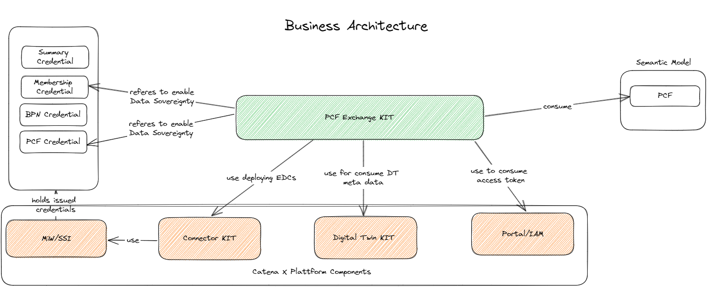

## Introduction 

## Vision & Mission

### Vision

Report and steer the de-carbonization of our value chain with dedicated measures based on real PCF values, without compromising upstream data sovereignty.

### Mission

Addressing supply chain carbon emissions today is missing reliable data about baseline emissions, effect of reductions, and best practices. This is due to three reasons:

- Complexity of supply chains leading to huge amount of data: complex supply chains spanning different countries and actors from many industries lead to huge amounts of data.
  
- Lack of Trust: Unwillingness to share data because of risk of losing competitive advantage, because data is shared with competitors.
  
- Missing standards for measuring carbon emissions in a comparable way.

At the core of our project is the recognition of a current challenge - the lack of transparency and accessibility to real PCF information in supply chains. Through our project, we strive to bridge this information gap by establishing a trusted and collaborative and interoperable environment. Suppliers will have the opportunity to share their PCF data with confidence, knowing that it remains sovereign and under their control.

We will address this by working on trustworthy ecosystem that prioritizes data sovereignty, security, and collaboration on standards. Therefore, our mission is to revolutionize the supply chain industry by providing a platform where suppliers can securely share their primary Product Carbon Footprint (PCF) data throughout the supply chain.

We are guided by the following principles:

- **Building trust** by making clear rules for data exchange and by pre-agreed data contracts between partners in the value chain.
- Building trust through **data sovereignty and data security**. We will build an ecosystem to share minimal data on a need-to-know basis, incorporating 3rd party verification by trusted partners. Decentralized architectures ensure that data remains within companies and is only shared with authorized persons as needed.
- **Governance** on the principles of mutual collaboration in the automotive industry and across with all relevant actors of the value chain on the principle of equality between partners, involving relevant outside stakeholders and the scientific community.
- **Flexibility and interoperability** by building an ecosystem of interoperable apps based on open standards. Collaborative standards for collecting, calculating, and sharing emission and product data make these processes more efficient and comparable.
- **Scalability** and manageability of large amounts of data. Decentralized data ecosystems can handle and scale large amounts of data, as decentralized structures are created as required by participating companies.

## Business Process

### Premises and assumptions

We assume that the calculation and exchange of PCF data is “new territory” for many companies. In large or larger enterprises (e.g., OEM or Tier-1 suppliers), the topic of sustainability with its various facets has been on the agenda for several years now. Appropriate structures and organizations were set up there. In this respect, it can be assumed that they have the expertise and resources for a PCF calculation. Corresponding, self-developed IT tools can also be found there. We cannot expect this for small and medium-sized enterprises (SMEs). In particular small companies often lack the knowledge and resources to calculate a PCF.

The following premises are therefore relevant for the following customer journeys:

- A PCF calculation requires expert or at least in-depth knowledge.
- A PCF calculation is currently mostly created manually; automation is not common or possible in most cases.
- Automation is also not yet feasible because there are no concepts or standards for verifying PCF data.
- Due to the (manual) effort, PCF calculation and data exchange will initially only be carried out for selected products.

Accordingly, the presented customer journeys are characterized by manual process steps. However, as the topic becomes more widely known in the automotive supply chain (especially among SMEs), greater automation should be sought. This is the only way to represent a larger (ideally the entire) range of products.

### Overview

The scope of our business process is the calculation and the exchange of Product Carbon Footprint (PCF) data across the supply chain for parts / components that are already in series production (→ "after start of production (SOP)").  One can therefore assume that a real supply chain already exists for this part / component.

To describe the process, we defined two customer journeys:

1. The customer journey “PCF data exchange” describes an asynchronous communication process: A customer requests the PCF from their supplier for a component (“PCF Request”), and the supplier provides the requested data (“PCF Response”).
2. If necessary, the requested PCF data must first be determined; this leads to the second customer journey “PCF calculation”.

The exchange-process is initiated top-down (e.g., at the OEM; but it can also start at any level of the supply chain), starting with a request of a customer to the supplier. It could then be continued step by step throughout the entire tier-n supply chain. Ideally, the entire supply chain (or actually: the entire supply tree) would be covered via this cascading request/response process. The result would be a PCF that is 100% based on requested and reported data.


In the real world, this will not be implemented this way, at least in the short and medium term. It can be assumed that this process and information chain will break down at certain points in the supply chain. There, data is not requested, but is calculated using secondary data, as is standard procedure these days. There can be various reasons for this:

- The affected part of the supply chain is only of minor relevance to the PCF; the effort required to determine the real data would therefore not be worthwhile.
- The supplier cannot or does not want to provide corresponding data.
- …

However, it is important that a PCF value reported from a supplier to its customer always represents the entire supply chain behind it. Therefore, the following data is recorded in a PCF calculation and aggregated to form the resulting PCF:

- direct emissions, that are generated in the supplier's own production system ("Scope 1")
- indirect emissions from purchased energy ("Scope 2")
- upstream emissions caused by purchased products from the upstream supply chain ("Scope 3")


The data for direct and indirect emissions will usually come from internal data sources, as these emission-shares are generated in the supplier's own production system. The upstream emissions ("Scope 3") can either be requested from the respective sub-supplier. Or it could be calculated, e.g., by using information from eco-databases.Putting all together, the transparency on the PCF for a given part or component is created through a cascade of top-to-bottom PCF requests, and a cascade of aggregated PCF data from bottom to top.

### Customer Journey "PCF Data Exchange"

This customer journey describes the exchange of PCF data in an asynchronous request/response process.


PCF data is exchanged between a data consumer (e.g., supplier on tier n) and a data provider (e.g., supplier on tier n+1). It is basically an asynchronous request/response process that is started by the data consumer:

1. The data consumer realizes that he needs the PCF for a specific component and that this data is not available in his local data (or is not of sufficient quality).
2. With his PCF Data exchange tool, the data consumer checks whether the required PCF data is available via Catena-X (from a technical perspective, this means that there is already a digital twin for the component and that he PCF submodel is available for this twin). If so, the tool would “fetch up” this data. If not, the user can request this data from the supplier as described in the next steps.
3. The data consumer submits a “PCF request” (according to the standardized API <Link einfügen>) to his supplier. In doing so, he asks the supplier to provide PCF data for the specific component, which was determined in accordance with the requirements of the Catena-X PCF Rulebook.

With this request, the process temporarily ends for the data consumer. The ball is now in the data provider's playing field.:

4. The data provider receives the PCF request (message/display in his PCF data exchange tool). To answer this request, he takes the following steps:
5. The data provider checks whether the requested data is already available (i.e., whether the PCF has already calculated in the past but has not yet been provided to the customer).
6. If the data is not yet available, the data provider must create it first. At this point, he starts the “PCF calculation” subjourney (see below). At the end of this subjourney, the PCF data is available, and the provider can answer the original request with the next steps.
7. The data provider sends a PCF Response (according to the standardized API see [Development View](../docs/Software%20Development%20View/pcf-echange-api/)) to the data consumer. At the same time, the data is made available in Catena-X (which means from a technical perspective, that a PCF submodel is attached to the corresponding digital twin of the component).

For the data provider, the process is now over, and the consumer's request has been answered with the response. Now follow a few more steps on the consumer side.

8. The data consumer, who sent the initial PCF request, now receives the PCF response (message/display in his PCF data exchange tool).
9. With the data exchange tool, the consumer can access and “pick up” the PCF data, according to the standardized PCF data model (see [Semantic Model](#semantic-models)).

>**Remark:**
>There are currently no options for data verification or acceptance/rejection of transmitted data at this stage in the process. These topics are currently still being discussed at Catena-X association level and are therefore not yet covered in the processes and tools. This will only happen with later releases.

10.	The data consumer can now transfer this data to his internal systems/databases (e.g., a PCF calculation tool), and use it for the internal business processes (e.g., PCF calculation or reporting).
This ends this customer journey.

### Customer Journey “PCF Calculation”

This customer journey describes the calculation of a CX Rulebook-compliant PCF, with some of the required data obtained via the Catena-X network.


The calculation process will often be triggered by an incoming PCF request (see subjourney "PCF data exchange", step 6). But of course, a PCF calculation can also be carried out proactively without a corresponding request via PCF Request.
To determine a PCF, an appropriate calculation tool is usually used, which guides the user through the process and ensures that all relevant data is taken into account. We will limit ourselves here to a generic, tool-independent presentation of the most important steps.

1. Make a plan: What are the different components of the PCF? Where can I get the relevant data from?
→ This structuring should be supported by an appropriate process in the calculation tool.
2. Put the direct emissions from the production site (e.g., use of natural gas or fuels) into the calculation.
→ Get the raw data from internal data sources and enter them in the calculation tool.
3. Put the indirect emissions from purchased energy into the calculation.
→ Get the raw data (consumption values, energy mix, …) from internal data sources and from the energy supplier, and enter it in the calculation tool.
4. Upstream emissions:
    1. For sub-components with a (expected) relevant share on the PCF, the aim is to use real data (or primary data) for the calculation. Therefore, a PCF request is sent to the suppliers of these sub-components, to obtain appropriate real data (see subjourney "PCF data exchange"). As soon as the data is available (via a PCF Response), it can be used as input for the calculation.
    2. For other sub-components, which only make up a small proportion of the upstream emissions, there will be no request of data to the supplier. Instead, the data will be obtained from a database for secondary data.
5. If necessary, put other emissions and further data into the calculation (e.g., transport emissions, waste, recycling quotas, ...).
6. Put it all together and get the overall PCF.
7. Transfer PCF to the exchange tool (or in general: make the PCF data available).

### PCF Personas

Persona|Role and Task (in lager Companies)|Challenges|Catena-X Contribution|
-------|---------------------------------------------|---------------------|--
Purchaser|In general, the purchaser will not be a sustainability expert! Sustainability is for him just an additional dimension (as cost, quality, ...). He is the central interface to the supplier and the owner of the sourcing decision process. In the PCF context this means:
PCF Controller (product)|
Sustainability Manager (product)|
Sustainability Manager (corporate)
Salespeople|
Auditor (external)|
Sustainability Associations / Institutions


## Semantic Models

Depending on the use case and related KIT, Catena-X provides different semantic models that help to structure and make use of data via semantic information. These models help to provide a basic meaning to the data and their relationship, thereby enabling interoperability between data sets. Catena-X data models rely on principles as understandability, standardization, accuracy, differentiation, auditability, comprehensiveness, and provision of insights to drive improvement actions.

### PCF

#### Introduction

In an era defined by growing environmental consciousness and sustainability imperatives, the concept of measuring and reducing carbon footprints has become paramount across industries. A pivotal key in this pursuit is a alligned and standardized Product Carbon Footprint Data Model. This data model not only facilitates the systematic calculation and comparison of carbon footprints but also offers a structured approach to managing environmental impact data.

As the global community grapples with the impacts of climate change, consumers, businesses, and governments are seeking actionable ways to mitigate their carbon emissions. The need for a consistent and universally accepted method of quantifying these emissions from diverse products has given rise to the significance of a Standardized Product Carbon Footprint Data Model. This model acts as a lingua franca, enabling stakeholders to communicate and analyze carbon footprint information transparently and comprehensively.

For this KIT only the data model PCF is used. The data model follows the Catena-X Standard [CX-0026](test) and is modeled following the [CX0003](test) Standard.


#### Example Payload

The following json shows a example payload for a requested pcf value.
```json
{
    "specVersion": "2.0.1-20230314",
    "companyIds": {
        "companyId": "urn:uuid:51131FB5-42A2-4267-A402-0ECFEFAD1619"
    },
    "extWBCSD_productCodeCpc": "011-99000",
    "created": "2022-05-22T21:47:32Z",
    "companyName": "My Corp",
    "extWBCSD_pfStatus": "Active",
    "version": 0,
    "productName": "My Product Name",
    "pcf": {
        "biogenicCarbonEmissionsOtherThanCO2": 1,
        "distributionStagePcfExcludingBiogenic": 1.5,
        "biogenicCarbonWithdrawal": 0,
        "distributionStageBiogenicCarbonEmissionsOtherThanCO2": 1,
        "extWBCSD_allocationRulesDescription": "In accordance with Catena-X PCF Rulebook",
        "exemptedEmissionsDescription": "No exemption",
        "distributionStageFossilGhgEmissions": 0.5,
        "exemptedEmissionsPercent": 0,
        "geographyCountrySubdivision": "US-NY",
        "extTFS_luGhgEmissions": 0.3,
        "distributionStageBiogenicCarbonWithdrawal": 0.5,
        "pcfIncludingBiogenic": 1,
        "aircraftGhgEmissions": 0,
        "productMassPerDeclaredUnit": 0.456,
        "productOrSectorSpecificRules": [
            {
                "extWBCSD_operator": "PEF",
                "productOrSectorSpecificRules": {
                    "ruleName": "urn:tfs-initiative.com:PCR:The Product Carbon Footprint Guideline for the Chemical Industry:version:v2.0"
                },
                "extWBCSD_otherOperatorName": "NSF"
            }
        ],
        "extTFS_allocationWasteIncineration": "cut-off",
        "pcfExcludingBiogenic": 2,
        "referencePeriodEnd": "2022-12-31T23:59:59Z",
        "extWBCSD_characterizationFactors": "AR5",
        "secondaryEmissionFactorSources": [
            {
                "secondaryEmissionFactorSource": "ecoinvent 3.8"
            }
        ],
        "unitaryProductAmount": 1000.0,
        "declaredUnit": "liter",
        "referencePeriodStart": "2022-01-01T00:00:01Z",
        "geographyRegionOrSubregion": "Africa",
        "fossilGhgEmissions": 0.5,
        "boundaryProcessesDescription": "Electricity consumption included as an input in the production phase",
        "geographyCountry": "DE",
        "extWBCSD_packagingGhgEmissions": 0,
        "dlucGhgEmissions": 0.4,
        "carbonContentTotal": 2.5,
        "extTFS_distributionStageLuGhgEmissions": 1.1,
        "primaryDataShare": 56.12,
        "dataQualityRating": {
            "completenessDQR": 2,
            "technologicalDQR": 2,
            "geographicalDQR": 2,
            "temporalDQR": 2,
            "reliabilityDQR": 2,
            "coveragePercent": 100
        },
        "extWBCSD_packagingEmissionsIncluded": true,
        "extWBCSD_fossilCarbonContent": 0.1,
        "crossSectoralStandardsUsed": [
            {
                "crossSectoralStandard": "GHG Protocol Product standard"
            }
        ],
        "extTFS_distributionStageDlucGhgEmissions": 1,
        "distributionStagePcfIncludingBiogenic": 0,
        "carbonContentBiogenic": 0
    },
    "partialFullPcf": "Cradle-to-gate",
    "productIds": {
        "productId": "urn:gtin:4712345060507"
    },
    "validityPeriodStart": "2022-01-01T00:00:01Z",
    "comment": "Comment for version 42.",
    "id": "3893bb5d-da16-4dc1-9185-11d97476c254",
    "validityPeriodEnd": "2022-12-31T23:59:59Z",
    "pcfLegalStatement": "This PCF (Product Carbon Footprint) is for information purposes only. It is based upon the standards mentioned above.",
    "productDescription": "Ethanol, 95% solution",
    "precedingPfIds": {
        "id": "3893bb5d-da16-4dc1-9185-11d97476c254"
    }
}
```

The entire data model is available as open source through the link provided below.

```text
https://github.com/eclipse-tractusx/sldt-semantic-models/tree/main/io.catenax.pcf/4.0.0
```

## Business Architecture

